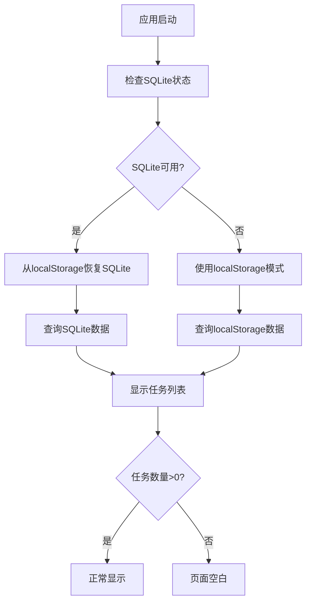

# 数据显示问题分析与解决方案

## 🔍 问题现象

您遇到的问题：
- **图1 数据同步**: 显示128.1 KB存储大小，任务数量为0
- **图2 数据库管理**: 显示0.13 MB数据库大小，存储方式为localStorage
- **页面显示**: 尽管有数据存储，但页面显示为空白

## 📊 数据大小关系解析

### 两个数值的关系
```
图1: 128.1 KB = 128,100 字节
图2: 0.13 MB = 133,120 字节 (约)
```

**结论**: 这两个数值指向的是**同一份数据**！

### 计算方式差异
- **数据同步 (128.1 KB)**: 计算整个localStorage的大小
  ```typescript
  // 包括所有键名和值的字符长度
  storageSize += key.length + value.length
  ```

- **数据库管理 (0.13 MB)**: 计算SQLite数据库的大小
  ```typescript
  // 数据库文件的实际大小
  stats.size.toFixed(2) + ' MB'
  ```

## 🔍 页面空白的可能原因

### 1. 数据存储与显示流程



### 2. 常见问题点

#### 问题1: 数据迁移问题
- **现象**: localStorage中有任务数据，但SQLite中没有
- **原因**: 数据迁移过程中断或失败
- **检查**: 任务数量显示为0，但存储大小不为0

#### 问题2: SQLite初始化失败
- **现象**: 有SQLite数据但初始化失败
- **原因**: WASM文件加载失败、浏览器兼容性问题
- **检查**: 存储方式显示为localStorage而非SQLite

#### 问题3: 数据格式不匹配
- **现象**: 数据存在但无法正确解析
- **原因**: 数据格式版本不兼容
- **检查**: 控制台出现解析错误

#### 问题4: 查询逻辑错误
- **现象**: 数据存在但查询返回空结果
- **原因**: SQL查询条件错误、分页逻辑问题
- **检查**: 数据库有数据但页面显示为空

## 🛠️ 调试工具使用

我已经为您创建了一个调试工具，可以帮助诊断问题：

### 在浏览器控制台中使用

```javascript
// 1. 检查所有存储状态
await debugHelper.logStorageDebugInfo()

// 2. 检查数据一致性
const consistency = await debugHelper.checkDataConsistency()
console.log(consistency)

// 3. 自动修复数据问题
await debugHelper.fixDataIssues()

// 4. 强制重新初始化SQLite
await debugHelper.forceReinitSQLite()
```

### 调试信息解读

```
🔍 ===== 数据存储调试信息 =====
📍 当前URL: http://192.168.1.2:3000/

💾 localStorage状态:
  - 有数据: true/false          ← 是否有任何数据
  - 任务数量: 0                 ← localStorage中的任务数量
  - 存储大小: 128.1 KB          ← 总存储大小
  - 示例数据: [...]             ← 前3个任务示例

🗄️ SQLite状态:
  - 已初始化: true/false        ← SQLite是否成功初始化
  - 有数据: true/false          ← SQLite中是否有任务
  - 任务数量: 0                 ← SQLite中的任务数量
  - 示例数据: [...]             ← 前3个任务示例

🔗 localStorage中的SQLite数据:
  - 存在: true/false            ← 是否有SQLite数据库文件
  - 大小: 128.1 KB              ← SQLite数据库文件大小
```

## 🔧 解决方案

### 方案1: 使用调试工具自动修复

1. **打开应用**并按F12打开开发者工具
2. **切换到Console标签**
3. **运行调试命令**:
   ```javascript
   await debugHelper.fixDataIssues()
   ```
4. **刷新页面**查看是否解决

### 方案2: 手动数据迁移

如果自动修复失败，可以手动迁移：

```javascript
// 1. 检查localStorage中的任务
const tasks = JSON.parse(localStorage.getItem('kanban_tasks') || '[]')
console.log('localStorage任务:', tasks)

// 2. 如果有任务，手动迁移到SQLite
if (tasks.length > 0) {
  await debugHelper.forceReinitSQLite()
  // 页面会自动刷新
}
```

### 方案3: 数据同步工具

使用数据管理中心的数据同步功能：

1. **点击"数据管理"按钮**
2. **切换到"数据同步"标签**
3. **检查存储状态**
4. **如果有数据但页面空白，尝试导出再导入**

### 方案4: 清理重置

如果以上方案都不行，可以清理数据重新开始：

```javascript
// 清理所有数据
debugHelper.clearAllData()
// 然后重新导入您的数据
```

## 📋 常见问题排查清单

### ✅ 检查清单

- [ ] **URL一致性**: 确保使用相同的URL访问应用
- [ ] **浏览器兼容性**: 使用Chrome/Firefox/Edge最新版本
- [ ] **控制台错误**: 检查是否有JavaScript错误
- [ ] **网络连接**: 确保WASM文件可以正常加载
- [ ] **存储空间**: 确保浏览器有足够的存储空间
- [ ] **数据格式**: 确认数据格式正确

### 🔍 诊断步骤

1. **打开开发者工具** (F12)
2. **查看Console输出** - 应用启动时会自动输出调试信息
3. **检查Network标签** - 确认WASM文件加载成功
4. **运行调试命令** - 使用debugHelper检查数据状态
5. **尝试修复** - 运行自动修复功能

## 🎯 预防措施

### 避免数据丢失
1. **定期备份**: 使用数据管理中心导出数据
2. **固定URL**: 使用开发服务器模式 `npm run dev`
3. **浏览器设置**: 避免清除浏览器数据
4. **版本控制**: 保留数据文件的多个版本

### 最佳实践
1. **使用开发服务器**: `npm run dev` 而非直接打开HTML文件
2. **定期检查**: 使用调试工具定期检查数据状态
3. **及时修复**: 发现问题时立即使用修复工具
4. **数据同步**: 在不同设备间定期同步数据

---

## 🆘 如果问题仍然存在

如果按照以上步骤仍然无法解决问题，请：

1. **运行完整诊断**:
   ```javascript
   await debugHelper.logStorageDebugInfo()
   const consistency = await debugHelper.checkDataConsistency()
   console.log('一致性检查:', consistency)
   ```

2. **截图保存**控制台输出信息

3. **尝试不同浏览器**测试

4. **检查数据文件**是否完整

记住：数据安全是第一位的，在进行任何清理操作前，请先导出备份！
